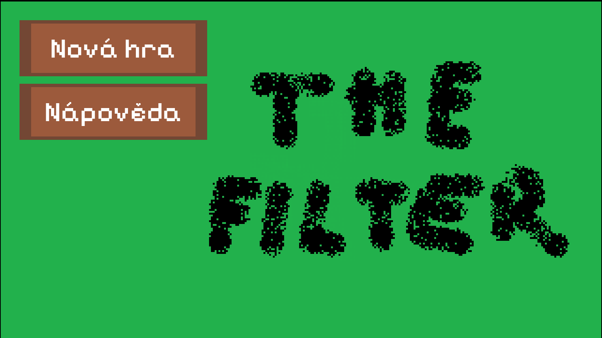

# The Filter

## popis programu
Jedná se o hru složenou z několika herních žánrů, primárně tower-defense, rpg a puzzle. Cílem projektu není vytvořit výjimečnou hru z hlediska gameplaye, ale spíše snaha sjednotit různé herní mechaniky do jednoho celku - jedná se tedy spíše o takový pokus než o seriózní projekt. Na druhou stranu budou scripty volně dostupné ke stažení, takže může sloužit jako boilerplate pro uživatele, jež by si chtěli nějak hru dále upravit, pokud obsahuje featury, které by se jim pro jejich projekt hodily.

Hra je naprogramována v herním enginu Godot za pomoci C#.

## popis hry
Primárně jde o puzzle hru s prvky rpg, tower-defense a farming simulatoru, i když všechny tyto herní styly jsou v této hře v dost jednoduchém provedení. Použitý grafický styl je pixel art. Nedostatečné vysvětlení hry je záměrné, aby se aspoň u něčeho hráč nenudil :D

## spuštění programu
Pro spuštění programu je nutné udělat:
- Nainstalovat Godot s podporou C#
- Stáhnout soubory z tohoto GitHub repozitáře (hlavně assets, scenes, scripts a zbytek souborů až na README.md, poznamky a programatorska_dokumentace.md)
- Spustit Godot a otevřít složku, do níž byly staženy soubory, jako projekt
- Spustit projekt a pomocí klávesy F5 spustit hru

Zatím nejsou k dispozici executables daného programu, jelikož je neustále aktualizován.

## spuštění hry
Jakmile spustíte program, objeví se Vám hlavní menu, kde máte 2 možnosti:
- Nová hra, což spustí samotnout hru
- Nápověda, kde je vysvětleno ovládání a stručný text o samotné hře

## ukončení programu
Zavřením okna, ve kterém hra běží.

## formát vstupu / ovládání
Uživatel se v menu pohybuje za pomoci myši a ve hře za pomoci kláves:
* WASD - pohyb,
* E - interakce (NPC, předměty, turrety...),
* TAB - zobrazení inventáře,
* ESC - pausa,

## gameplay
Cílem hráče je dostat se k jedné z finálních scén. Nyní jsou pouze 2 takové scény, takže přidání dalších konců je jedno z možných vylepšení tohoto projektu.

## herní featury
Ačkoliv je hra poměrně jednoduchá, je v ní naimplementována poměrně dost herních featur z různých herních žánrů. Jedná se primárně o:
- Pohyb hráče pomocí kláves
- Inventář (hráč má nějaký svůj seznam předmětů, který se v průběhu hry mění a lze jej zobrazit pomocí klávesy TAB) a interakce s předměty (sbírání, pokládání, používání...)
- Ekonomika (hráč může utrácet zabitá okna)
- Stavění a vylepšování věží
- Pěstování a sbírání předmětů (derivace)
- Interakce s NPCs (dialogy, koupě předmětů, získávání předmětů, spouštení fází hry závislých na progressu dialogu)
- Fungování věží (zaměřování nepřátel, rozlišování nepřátel)
- Interakce nepřátel mezi sebou (jeden nepřítel vylepšuje druhého)

## potřebné knihovny
* Godot
* základní systémové knihovny (.NET)
